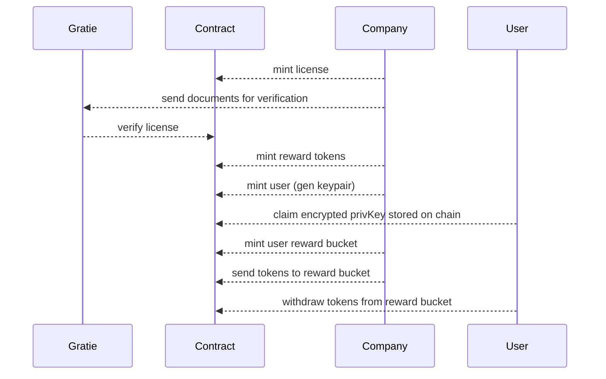

# Gratie Solana

## ROADMAP

* [x] Create reward tokens with erc-20 tokens based on the evaluation of the company
* [x] Create a rewards bucket (account) for every user of the company
* [x] Send company rewards to user bucket
* [ ] Add metadata to these reward tokens
* [ ] Unsafe: Create a link that allows the user to withdraw from the bucket to his account, this link will be sent to the user via email, maybe do some verification using merkle trees?

## Diagram

## Notes

Company: enterprise that wants to use gratie
User: employee of the company

* changing structure of accounts in the src/state folder might break the tests because existing accounts on the network will have a different structure
* it would be great to have metaplex on the localnet

### Ideas

* User could potentially have multiple buckets, one for each company
* User could see all these buckets in the same wallet
* User could trade reward tokens from one company for reward tokens from another company

### How user buckets will be created and authenticated by user
* the users keys will be encrypted by their email and password
* the users keys will be derived from an account that will be created by the program, the company can have no access to the private key of this account because if they do they can withdraw the tokens from the user's bucket